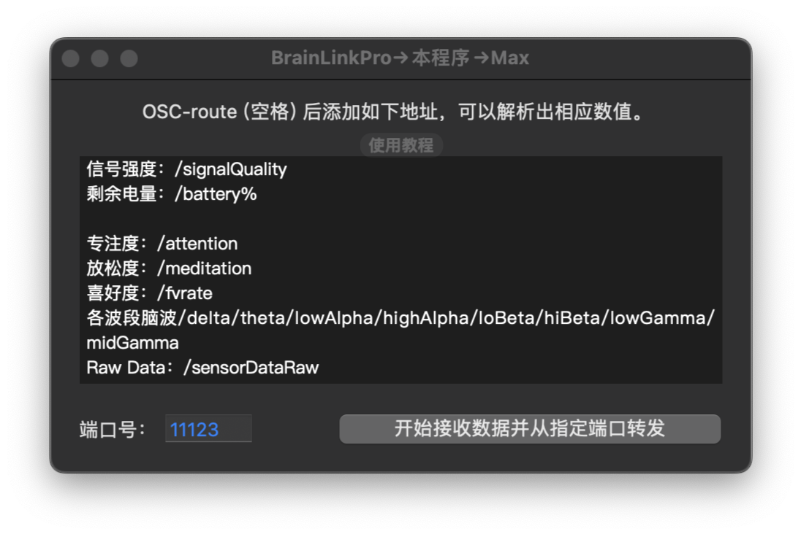
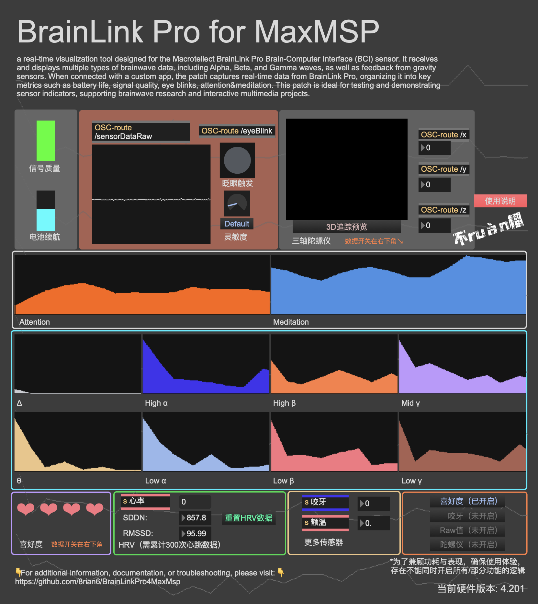
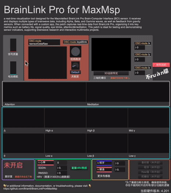
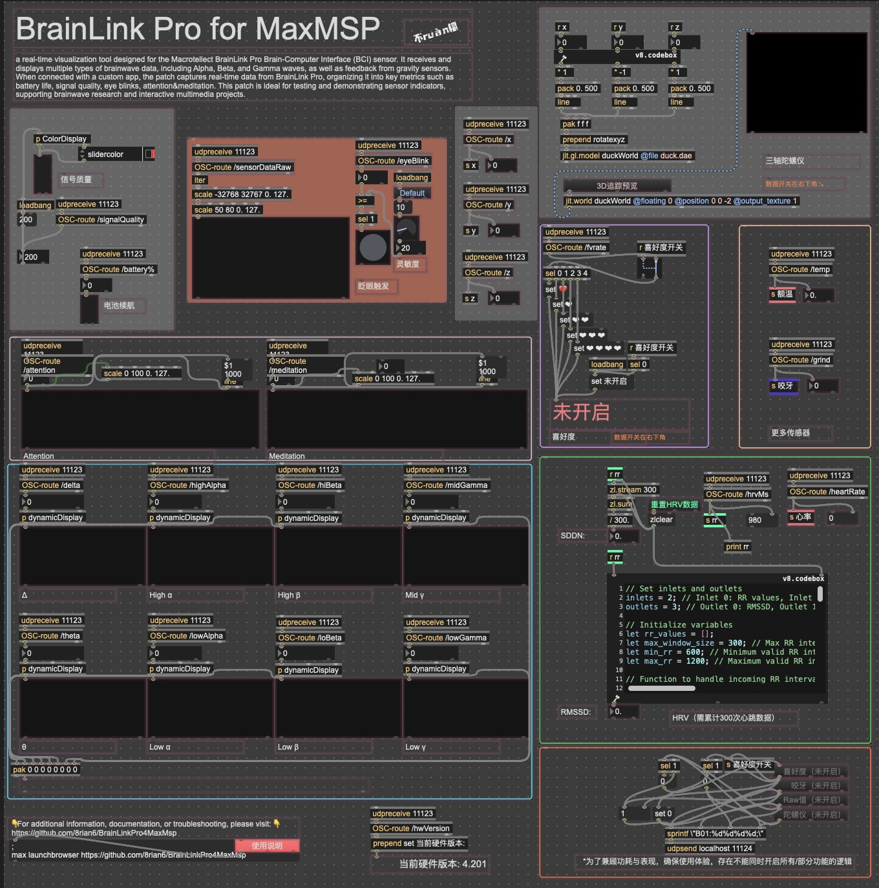

# BrainLinkPro4MaxMSP

**BrainLinkPro4MaxMSP** 是一个通过蓝牙、 UDP、OSC协议共同实现 BrainLink Pro 数据与 Max/MSP 交互的工具。它支持实时接收脑波、心率等传感器的数据，并提供双向通信机制，用户可以通过 Max/MSP 发送控制指令，动态调整数据流内容。

在本程序开发之前，BLP并不具备与Max等软件直接通信的能力，因此要把BLP采集的脑波数据用于交互，需编写专门的应用程序，这对许多对编程不熟悉的用户来说，成为了一个主要的障碍，制约了基于脑波的互动创作的广泛应用。BrainLinkPro4MaxMSP 的目标就是通过降低技术门槛，打破代码恐惧的壁垒，为脑波与艺术、交互领域的结合提供简单、高效的解决方案。

---

## 项目目录

```
BrainLinkPro4MaxMSP/
├── image/                  # 运行图片展示
├── MAX/                    # Max/MSP 示范文件
│   └── BrainLinkPro4MaxMsp_1.35.maxhelp
├── release/                # 编译后的应用程序
│   └── MAC_BrainLinkPro4Max1.35.app
├── src/                    # OC源代码文件
│   ├── MAC_HZLBlue4.0Demo/
│   └── MAC_HZLBlue4.0Demo.xcodeproj
└── README.md               # 项目说明文档
```
---

## 1.35版功能特点

1. **实时数据接收与转发**：
   - 已支持最新BrainlinkPro的全部数据类型：脑波数据、HRV、陀螺仪、高频原始数据等。
   - 用户可以自定义 OSC 数据发送端口。

2. **双向通信**：
   - Max/MSP 可以通过固定的端口（`11124`）发送控制指令，动态调整获取数据类型。

3. **OSC 地址路由**：
   - 数据流以不同的 OSC 地址区分，例如 `/attention`（专注度）、`/gravity`（重力传感器数据）。

4. **模块化设计**：
   - 提供易于扩展的代码和示例 Max 补丁文件，并在Max端解析出SDDN、RMSSD等数据。使之直接可用于更复杂的生物反馈与实时数据可视化场景。


## 安装和使用

### 环境要求

- **操作系统**：macOS Catalina 或更高版本
- **软件**：Max/MSP 版本 9.0 或更高

### 依赖安装

1. **OSC Route 扩展**  
   本项目使用了 CNMAT 提供的 `osc-route` 对象来解析和路由 OSC 数据包。请按以下步骤安装：
   - 打开 Max/MSP。
   - 进入菜单 **File > Package Manager**。
   - 搜索 **CNMAT** 并安装 **CNMAT Externals**。
   - 验证：在 Max 中创建一个对象，输入 `osc-route`，如果正常加载则说明安装成功。

---

### 使用方法

1. **运行应用程序**：
   - 打开 `release/MAC_BrainLinkPro4Max1.35.app`。
   - 设置 OSC 数据发送的目标端口，默认为 `11123`。
### 应用程序运行界面


2. **配置 Max/MSP**：
   - 打开 `MAX/BrainLinkPro4MaxMsp_1.35.maxhelp` 文件。
   - 确保 Max 的接收端口与应用程序的发送端口一致。
### Maxhelp界面


3. **查看 Hint 提示**：
   - 鼠标移到 Max/MSP 模块上即可查看数值的详细解释，包括数据的单位，来源和用途。
### Max 模块 Hint 提示演示
<br> 

4. **如果需要根据自己的需求调整功能**：
   - 退出Max的Presentation Mode（演示模式），进入 Edit Mode（编辑模式），自由修改补丁结构和功能模块。
### Maxhelp在非演示模式下的界面


---

## 开发与自定义

- 源代码路径：`src/MAC_HZLBlue4.0Demo.xcodeproj`。
- 支持自定义 OSC 路由地址和端口。
- 需要重新编译应用程序时，确保已安装可以编译OC的Xcode。

---

## 数据类型和 OSC 地址


| 数据类型           | OSC 地址             | 备注                                             
|-------------------|----------------------|-------------------------------------------------
| 信号质量           | `/signalQuality`     | 默认开启，无需特殊条件。                          
| 剩余电量           | `/battery%`          | 显示剩余电量百分比，默认开启。                    
| 专注度             | `/attention`         | 默认开启，无需特殊条件。                          
| 放松度             | `/meditation`        | 默认开启，无需特殊条件。                          
| 喜好度             | `/fvrate`            | Max 中手动开启；开启后自动停止 Raw Data、心率和 HRV 数据流。 
| 各波段脑波         | `/delta` 等          | 详见接收转发程序界面。                               
| 原始数据（Raw Data）| `/sensorDataRaw`     | Max 中手动开启；喜好度开启后自动停止。             
| 心率               | `/heartRate`         | 喜好度开启后自动停止；关闭喜好度后自动开启。       
| RR周期             | `/hrvMs`             | 喜好度开启后自动停止；关闭喜好度后自动开启。       
| **SDDN**           | *无 OSC 地址*        | 在 Max 端基于心率数据计算得出，表示心率波动的标准差。 
| **RMSSD**          | *无 OSC 地址*        | 在 Max 端基于心率数据计算得出，表示心率变异性的均方根差值。 
| 眨眼强度           | `/eyeBlink`          | 默认开启，无需特殊条件。                          
| 咬牙状态           | `/grind`             | Max 中手动开启；喜好度开启后自动停止。             
| 额温               | `/temp`              | 默认开启，无需特殊条件。                          
| 陀螺仪             | `/x` `/y` `/z`       | Max 中手动开启，需开关按钮朝上、保持静止水平状态开机。 
| 固件版本           | `/hwVersion`         | 默认开启，无需特殊条件。                          

---


## 问题反馈

如有问题，请提交 Issue 。

---

